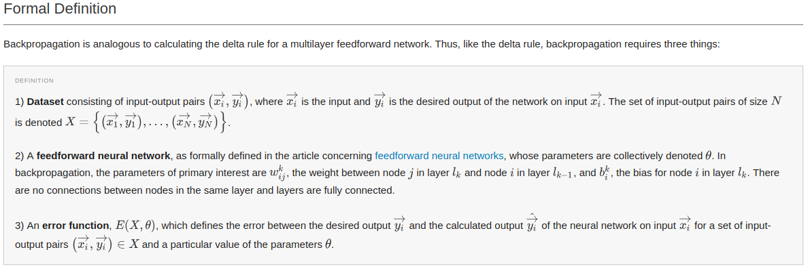

# smmlp

## About
It's a simple multilayer perceptron model, implemented in c++ to get an inner idea about backpropagation.

## Backpropagation

More about this on [**brilliant.org**](https://brilliant.org/wiki/backpropagation/)

## File Description

For a simple MLP model i wrote 6 important file:
- layer.cpp
- node.cpp
- network.cpp
- sample.h
- utils.h
- main.cpp

#### main.cpp: The smmlp models entry point where you can define your model structure and process traning and test data for your model.

##### layer.cpp: With layer.h where i define all layers update/matrix manipulation.
##### node.cpp: with node.h where i define node's update/matrix manipulation
##### network.cpp: with network.h where i define network structure (I mean number of neuron, number of layer)
##### sample.h: Training sample structure
##### utls.h: Different kind of helper function

### Note
Don't forget to say thanks [davidalbertonogueira](https://github.com/davidalbertonogueira). Most of the code are borrowed from him.

**My blog:** [**smafjal**](https://smafjal.github.io/)
